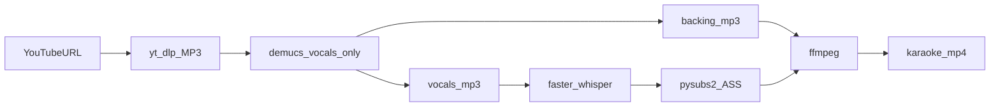

# Karaoke Video Generator

Generate simple karaoke videos from a YouTube link: download audio, separate vocals locally, sync lyrics (auto-transcribe or from a text file), and render a line-at-a-time MP4 with instrumental audio.

## Architecture

- **Compose Desktop (Kotlin)** — GUI for URL input, optional lyrics, progress, and output folder
- **Python FastAPI backend** — download (`yt-dlp`), stem separation (`demucs-onnx`), lyrics sync (`faster-whisper`), video render (`ffmpeg` + `pysubs2`)

The desktop app starts the backend automatically on a free local port.

## Prerequisites (WSL Ubuntu)

### System packages

```bash
sudo apt update
sudo apt install -y ffmpeg python3 python3-venv python3-pip openjdk-17-jdk
```

- **ffmpeg** — required for YouTube MP3 extraction, audio probing, and video rendering
- **python3-venv** — required for the backend virtual environment
- **OpenJDK 17+** — required to build/run the Compose Desktop app

### WSL GUI (WSLg)

The desktop UI needs WSLg on Windows 11/10:

```bash
# On Windows (PowerShell as admin)
wsl --update
```

Inside WSL, verify GUI support:

```bash
echo $WAYLAND_DISPLAY   # often wayland-0 when WSLg is active
```

If the window does not appear, update WSL on the Windows host and ensure you are on WSL 2.

## Setup

From the project root:

```bash
cd karaoke-video-gen
chmod +x setup.sh
./setup.sh
```

`setup.sh` will:

1. Create `backend/.venv`
2. Install Python dependencies
3. Prefetch ML models (~800 MB total on first run):
   - **demucs-onnx** vocals model (~316 MB)
   - **faster-whisper** `small` model (~500 MB)

Models are cached under `~/.cache/huggingface/hub/`.

## Run

### Desktop app (recommended)

```bash
./gradlew :composeApp:run
```

The app will:

1. Start the Python backend
2. Show model readiness
3. Let you paste a YouTube URL, optional lyrics, background color, and output folder
4. Stream job progress in the log panel

The log panel scrolls independently (auto-scrolls to the latest line). A full session log is also written to `logs/gui.log` in the project folder — use **Open log file** in the app to view it.

### Backend only (API / debugging)

```bash
cd backend
../backend/.venv/bin/python main.py
```

Default URL: `http://127.0.0.1:8765`

| Endpoint | Method | Description |
|----------|--------|-------------|
| `/health` | GET | Backend status + model cache check |
| `/setup/models` | POST (SSE) | Download/warm up models |
| `/jobs` | POST | Start a karaoke job |
| `/jobs/{id}` | GET | Job status |
| `/jobs/{id}/events` | GET (SSE) | Live progress stream |

## Usage

1. Open the app and click **Download models** if status shows missing models.
2. Paste a **YouTube URL**.
3. Optionally paste lyrics (one line per lyric line) or use **Load lyrics file**.
   - If omitted, lyrics are auto-transcribed from the separated vocal track.
4. Pick a background color (hex, default `#1a1a2e`).
5. Choose an output folder (default `~/Videos/karaoke-output`).
6. Click **Generate**.

Output: `Artist_Title_karaoke.mp4` in the output folder. Intermediate files are kept under `work/<job-id>/`.

## Pipeline



## Audio separation

demucs-onnx separates into **four stems**: drums, bass, other, vocals. There is no single “instrumental” output — the backing track is built as:

- `non_vocal` = **drums + bass + other** (demucs karaoke mix)
- `backing` (used in final video) = non_vocal + **vocal blend %** × vocals

Vocals are saved separately for lyrics timing. Default blend is 20% (`KARAOKE_VOCAL_BLEND=0.2` or the GUI slider).

Set `KARAOKE_DEMUCS_MODEL=htdemucs_ft` for higher-quality 4-pass separation (slower, more RAM).

## GPU acceleration

If `nvidia-smi` works in WSL, `./setup.sh` **probes** `onnxruntime-gpu` and only keeps it when import succeeds and `CUDAExecutionProvider` is listed. Otherwise it falls back to CPU `onnxruntime` automatically.

- **demucs-onnx** — `CUDAExecutionProvider` when available
- **faster-whisper** — `device=cuda`, `compute_type=float16` when CUDA works

Check `/health` for `cuda_available`, `demucs_providers`, and `whisper_device`.

### `libcudart.so.13: cannot open shared object file`

`nvidia-smi` can work while the CUDA **runtime libraries** onnxruntime-gpu needs are still missing. Re-run setup to fall back to CPU:

```bash
cd karaoke-video-gen
./backend/scripts/ensure_onnxruntime.sh
```

For real GPU inference, install a matching CUDA toolkit in WSL (so `libcudart` is on the library path), then re-run `./setup.sh`.

Force CPU:

```bash
export KARAOKE_ONNX_PROVIDERS=cpu
export KARAOKE_WHISPER_DEVICE=cpu
```

## Expected timings

For a typical 3–4 minute song:

| Step | CPU | GPU (NVIDIA) |
|------|-----|----------------|
| Download | 10–30 s | 10–30 s |
| Vocal separation | 2–5 min | ~30 s – 2 min |
| Lyrics sync (Whisper small) | 1–3 min | ~20 s – 1 min |
| Video render | 10–30 s | 10–30 s |

## Project layout

```
karaoke-video-gen/
├── composeApp/          # Kotlin Compose Desktop GUI
├── backend/             # Python FastAPI processing pipeline
├── setup.sh             # One-time environment + model setup
├── work/                # Per-job intermediate files (gitignored)
└── output/              # Default render output (gitignored)
```

## Troubleshooting

| Problem | Fix |
|---------|-----|
| `python3-venv` missing | `sudo apt install python3-venv` |
| `ffmpeg not found` | `sudo apt install ffmpeg` |
| Models not ready | Run **Download models** in the app or re-run `./setup.sh` |
| `libcudart.so.13` / onnxruntime import error | Run `./backend/scripts/ensure_onnxruntime.sh` (CPU fallback) |
| GUI does not open | Update WSLg (`wsl --update` on Windows) |
| Job fails on download | Check URL, network, and yt-dlp errors in the log panel |
| Lyrics timing feels off (manual lyrics) | Edit `work/<job-id>/lyrics.json` and re-render later (v2 feature) |

## Notes

- YouTube downloading is for personal use; respect copyright and YouTube Terms of Service.
- v1 renders **one centered line at a time** (no word-by-word karaoke highlight yet).
- The vocal stem is used for timing even when you supply lyrics text.

## License

Experimental one-off project. Dependencies have their own licenses (yt-dlp, demucs-onnx, faster-whisper, etc.).
